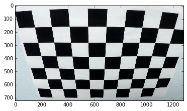
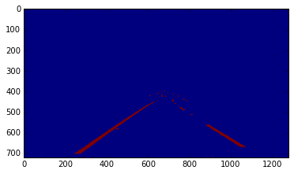
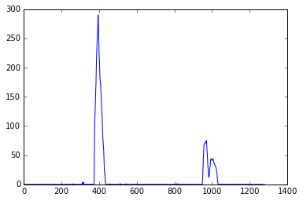
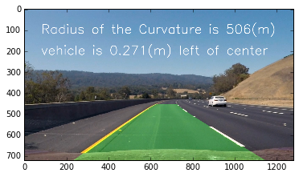

## Advanced Lane Finding

The Project
---

The goals / steps of this project are the following:

* Compute the camera calibration matrix and distortion coefficients given a set of chessboard images.
* Apply a distortion correction to raw images.
* Use color transforms, gradients, etc., to create a thresholded binary image.
* Apply a perspective transform to rectify binary image ("birds-eye view").
* Detect lane pixels and fit to find the lane boundary.
* Determine the curvature of the lane and vehicle position with respect to center.
* Warp the detected lane boundaries back onto the original image.
* Output visual display of the lane boundaries and numerical estimation of lane curvature and vehicle position.

The images for camera calibration are stored in the folder called `camera_cal`.  The images in `test_images` are for testing the pipeline on single frames.  

Examples of the output from each stage of the pipeline in the folder called `ouput_images`. The video output called `project_video_output.mp4` is the result video processed by the pipeline.

**distorted chessboard**

** **
**Undistorted chessboard**
  
** **
**Distorted test image**

** **
**Undistorted test image**

** **
**Color and gradients thresholded test image**

** **
**Masked image**

** **
**Perspective transformed image**

** **
**Histogram**

** **
**Slidingwindow**

** **
**Visualization of the found lanes pixels**

** **
**Final result**

