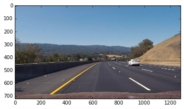

##Advanced Lane Finding Project

The goals / steps of this project are the following:

* Compute the camera calibration matrix and distortion coefficients given a set of chessboard images.
* Apply a distortion correction to raw images.
* Use color transforms, gradients, etc., to create a thresholded binary image.
* Apply a perspective transform to rectify binary image ("birds-eye view").
* Detect lane pixels and fit to find the lane boundary.
* Determine the curvature of the lane and vehicle position with respect to center.
* Warp the detected lane boundaries back onto the original image.
* Output visual display of the lane boundaries and numerical estimation of lane curvature and vehicle position.

## [Rubric](https://review.udacity.com/#!/rubrics/571/view) Points

### Here I will consider the rubric points individually and describe how I addressed each point in my implementation.  

---
### Camera Calibration

#### 1. Briefly state how I computed the camera matrix and distortion coefficients.

The code for this step is contained in the first code cell of the IPython notebook located in "P4.ipynb".  

I start by preparing "object points", which will be the (x, y, z) coordinates of the chessboard corners in the world. Here I am assuming the chessboard is fixed on the (x, y) plane at z=0, such that the object points are the same for each calibration image.  Thus, `objp` is just a replicated array of coordinates, and `objpoints` will be appended with a copy of it every time I successfully detect all chessboard corners in a test image.  `imgpoints` will be appended with the (x, y) pixel position of each of the corners in the image plane with each successful chessboard detection.  

I then used the output `objpoints` and `imgpoints` to compute the camera calibration and distortion coefficients using the `cv2.calibrateCamera()` function.  I applied this distortion correction to the test image using the `cv2.undistort()` function. An example result one could find from the following pictures:

### Pipeline (single image)

#### 1. An example of a distortion-corrected image.

To demonstrate this step, I will describe how I apply the distortion correction to one of the test images like this one:

#### 2. I used color transforms, gradients to create a thresholded binary image.

I used a combination of color and gradient thresholds to generate a binary image (thresholding steps at lines in the 2nd code cell in "P4.ipynb").  After a couple of experiments with different color space and  gradient thresholding I finally can get reasonable result. Here's an example of my output for this step.

#### 3. Then I masked the region of interest and performed a perspective transform of the image from step2

The code for my region of interest and my perspective transform included in a function called `image_warper()`, which appears in 4th code cell in the file `P4.ipynb`. The `image_warper()` function takes as inputs an image (`image`), as well as source (`src`) and destination (`dst`) points.  I chose the hardcode the source and destination points in one test image using photo viewer and they are as following:

| Source        | Destination   |
|:-------------:|:-------------:|
| 833,544     | 939,544       |
| 939,611     | 939,611      |
| 360,611    | 360,611      |
| 463,544      | 360,544       |

I verified that my perspective transform was working as expected by drawing the `src` and `dst` points onto a test image and its warped counterpart to verify that the lines appear parallel in the warped image.

#### 4. I used the histogram to identify the beginning of left and right lanes and used the sliding window approach to find the lane-line pixels and fit their positions with a polynomial fitting method.

I did this in 5th and 6th code cell in my code in `P4.ipynb`

#### 5. Calculate the curvature of the lane and the offset of the car to the middle point of two lanes.

I calculated the radius of curvature of two lane by calculating the first and second derivatives of the founding second order polynomial(same approach as used in the lecture 35) and make a average of this two curvatures to get the final curvature. I did this in 8th code cell in my code in `P4.ipynb`.

The position of the vehicle with respect to center is by comparing the middle point between two lanes and the middle point of the image. I did this in the 11th code cell (offset) in my code in `P4.ipynb`.

#### 6. The result is then plotted back down onto the road such that the lane area is identified clearly.

I implemented this step in the 9th cell in my code in `P4.ipynb` in the function `draw_lanes_area()`.  Here is an example of my result on a test image:

---

### Pipeline (video)

#### 1. The final video output

Here's a [link to my video result](./project_video_output.mp4). Each frame is going through the Pipeline define in the 11th code cell in `P4.ipynb`.

---

### Discussion

#### 1. Briefly discuss any problems / issues you faced in your implementation of this project.  Where will your pipeline likely fail?  What could you do to make it more robust?

In this project more advanced computer vision techniques are used. The color and gradient thresholding is very effective, although found the right combination from different color space and gradient direction could take many experiment and time. The histogram and sliding window approach is very effective and powerful. Since for a video, once we found the lanes position in one frame, we could reuse it and search the lanes in the next frames in a margin area. This is implemented in the
10th code cell.

However if the background noise/color is not very similar to the lanes color then the color space threshold could fail. Also if the color of the lane itself is very weak, then to let them stand out could also be very challenging.
