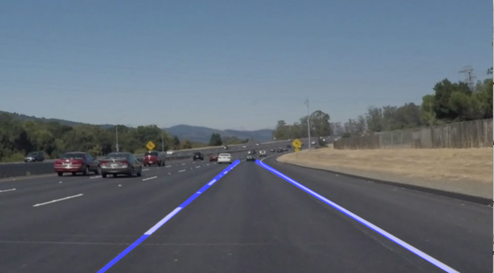

#**Finding Lane Lines on the Road**

Overview
---

When we drive, we use our eyes to decide where to go.  The lines on the road that show us where the lanes are act as our constant reference for where to steer the vehicle.  Naturally, one of the first things we would like to do in developing a self-driving car is to automatically detect lane lines using an algorithm.

In this project the detection of lane lines in images using Python and OpenCV is implemented. The most important files are: a file containing project code called **P1.ipynb** and a file containing a brief write up in **writeup.md** explaining my solution.

The images located in the **/test_images** are original unprocessed images provided by Udacity. They could be used to test the pipeline processing for single image. Uncomment the bottom three lines in the code block of "Build a Lane Finding Pipeline" to check single image results.

The videos in the **/test_videos** are original unprocessed videos provided by Udacity.

In the **/examples** there are a couple of processed image examples. The my_example_result.png is I provided and others are provided by Udacity.

The Project
---

One need to install the [CarND Term1 Starter Kit](https://github.com/udacity/CarND-Term1-Starter-Kit/blob/master/README.md) to make sure all necessary environment and needed libraries are available. Or You Install the individual library and setup environment manually(numpy, opencv,..).

Python3 and OpenCV3 are the versions being used in this Project.

##### Run the Project
**Step 1:** Open the code in a Jupyter Notebook file called **P1.ipynb**

**Step 2:** Run through the code till the code block **"Improve the draw_lines() function"**.  The output of the project are two videos located in /test_video_output directory.

**Note:** Due to time limitation, the challenging task is not handled yet. Hopefully I could finish it after my travel this week.
