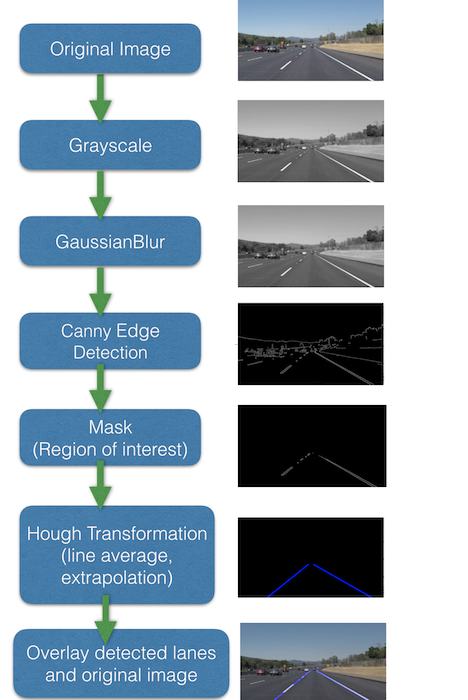

Reflection

###1. Description of Processing Pipeline

My pipeline consisted of 5 steps. First, I convert the image to grayscale, then I use gaussian blur to clean up the image. After that the canny edge detector is used to find all the edges in the smoothed grayscale image. Followed by defining the coordinate of a polygon vertices and using the region_of_interest function to mask the interesting region, the image will left only with the region where the lanes are located. In this case I can use hough line transformation to find all line segments inside the region of interest.

Check if the pipeline works in general and then start fine tuning the parameters for canny edge detector and hough line transformation.

In order to draw a single line on the left and right lanes, I modified the draw_lines() function by checking the slope of all detected line segments. Depending on the slope value positive or negative, I can categorize them to left or right side. One thing should be taken care are those false positive or false negative line segments, where e.g has a negative slope but actually belong to the right lane. Those line segments could be ruled out by comparing their x coordinate to the middle point of the image, so that it could avoid the drawn lines jumping around and two lane sometimes cross each other.

After averaging the x1,y1,x2,y2 of all line segments belong to left side, we could draw a single line attached to the left lane using the averaged coordinates. With extrapolation algorithm one could extend the single line till bottom of the image and the top of the region of interest. The same method is applied to right lane.

Followed figure illustrates the processing pipeline with an example image from each step.

###2. Identify potential shortcomings with your current pipeline

One potential shortcoming would be when suddenly a very sharp turn appears.

Another shortcoming could be if the high way road condition is very poor. The lanes could be very vague and have many discontinuities and noise. In this case the lane detection would be very challenging.

###3. Suggest possible improvements to your pipeline

A possible improvement would be to try more advanced algorithms to detect lanes and make it more robust against noise.(bird-eye perspective?)

Another possible improvement would be looking into more advanced algorithms to detect curves/sharp turns.
