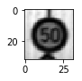

#**Traffic Sign Recognition**

---

##Build a Traffic Sign Recognition Project

The goals / steps of this project are the following:
* Load the data set (see below for links to the project data set)
* Explore, summarize and visualize the data set
* Design, train and test a model architecture
* Use the model to make predictions on new images
* Analyze the softmax probabilities of the new images
* Summarize the results with a written report

##Rubric Points
####Here I will consider the [rubric points](https://review.udacity.com/#!/rubrics/481/view) individually and describe how I addressed each point in my implementation.  

---
###Data Set Summary & Exploration

####1. This section provides a basic summary of the data set. In the code, the analysis was done using python, numpy and partially pandas methods rather than hardcoding results manually.

The code for this step is contained in the second code cell of the IPython notebook.  

Following is some of the summary statistics of the traffic signs data set:

* The size of training set is 34799
* The size of validation set is 4410
* The size of test set is 12640
* The shape of a traffic sign image is (32,32,3)
* The number of unique classes/labels in the data set is 43

Note: this is not the final statistics to train the CNN, since this project the data argumentation is used to expand the training dataset.

####2. Include an exploratory visualization of the dataset and identify where the code is in your code file.

The code for this step is contained in the Third to Fifth code cell of the IPython notebook.  A function of image drawing is implemnted, since draw function could be reused later on in this project.

Flowing is a example traffic sign training image.

Here is an exploratory visualization of the data set. It is a bar chart showing how the training examples are distributed.

###Design and Test a Model Architecture

####1. Preprocess the dataset

The code for this step is contained in the 6th-10th code cell of the IPython notebook.

As a first step, I decided to convert the images to grayscale because it will reduce the computation effort significantly.

Here is an example of a traffic sign image before and after gray scaling.

The I normalized the image data because we'd like for each feature to have a similar range so that our gradients is under control.

####2. Generation of additional data by augmenting data

The project used augmented data set. I decided to generate additional data because the distribution of the traffic sign of original dataset is not good. To add more data to the the data set, I used the techniques like image random rotation, translation, shearing. The new generated data set contains both original and augmented dataset, therefore doubled the number of training examples and increased its randomness.

Here is an example of an augmented image:

####3. Model architecture

The model I used is LeNet CNN with two convolution layer followed by three fully connected layers.

My final model consisted of the following layers:

| Layer         		|     Description	        					|
|:---------------------:|:---------------------------------------------:|
| Input         		| 32x32x3 grayscaled and normalized images
| Convolution 5x5     	| 1x1 stride, valid padding, outputs 28x28x10 	|
| RELU					|									outputs 28x28x10			|
| Max pooling	      	| 2x2 stride,  outputs 14x14x10 				|
| Convolution 5x5	    | 1x1 stride, valid padding, outputs 28x28x10     									|
| RELU					|											outputs 28x28x10	|
| Max pooling	      	| 2x2 stride,  outputs 5x5x20 				|
| Fully connected		| input 500=5x5x20, outputs 120        									|
| Fully connected		| input 120, outputs 84     									|
| Output    		| input 84, outputs 43 classes     									|

####4. Train the model

To train the model, I used an Adam Optimizer with a batch size of 128 and Epochs 70. Learning rate is 0.001 and dropout of 0.75.

####5. Final results and interactive process

The code for calculating the accuracy of the model is located in the 15th cell of the Ipython notebook.

My final model results were:
* training set accuracy of 0.98
* validation set accuracy of 0.97
* test set accuracy of 0.8

As starting point I took the advice from the Udacity lecture and used the LeNet used in the lecture as my initial model. The LeNet uses multiple convolutions layers together with pooling and Relu(non-linearity) to extract image features and followed by multiple fully connected layers as classifier.

In this initial LeNet there are two convolution layers with filter depth of 6 and 16 respectively and two fully connected layers with neurons number of 120, 84 respectively. The final output layer makes the final classification among 43 classes. It could achieve a validation accuracy of 0.85, which is pretty low.

Then I started preprocessing the dataset. By grayscale and normalization the validation accuracy was boosted to 0.92 and a similar training accuracy could be reached as well. However it's still not as high as I would like to see.

Then I decided to add more dataset to my training samples and by augmenting dataset using rotation, shearing and translation techniques, I generated additional artificial datasets. I added them to the original training dataset and therefore doubled the size of training dataset.

After I added augmented training examples, the training accuracy is very high but the validation accuracy is not increased and on the contrary, it was decreased. I suspected, it could be due to overfitting and thus I used dropout to reduce the overfitting. It turned out, that by using the dropout with keep_prop=0.75 the validation accuracy increased to 0.955. To get more accuracy I increased the first two convolution layers from 6,16 to 10,20 respectively. As a result of this the validation accuracy increased to around 0.97 and training accuracy of around 0.965.  The test set accuracy of 0.94 could prove fairly that the model works pretty well.

###Test a Model on New Images

####1. In this project I downloaded five German traffic signs from the web.

Here are five German traffic signs that I found on the web. I used image editor to resize their size to 32x32.

####2. Prediction of the new images

The code for making predictions on my final model is located in the 18th cell of the Ipython notebook.

Here are the results of the prediction:

| Image			        |     Prediction	        					|
|:---------------------:|:---------------------------------------------:|
| Slippery Road    		| Slippery Road   									|
| 70km/h    			| 70km/h 										|
| Yield					| Yield											|
| Stop sign	      		| Stop sign					 				|
| Road work			| Right-of-way at the next intersection     							|

The model was able to correctly predict 4 out of 5 new downloaded traffic sign images, which gives an prediction accuracy of 80%.

####3. Softmax probabilities of the five new images

The code for making predictions on my final model is located in the 20th cell of the Ipython notebook.

For the first image, the model is relatively sure that this is a sign of Slippery Road (probability of 0.6), and the image does indicate the same meaning. The top five soft max probabilities were

| Probability         	|     Prediction	        					|
|:---------------------:|:---------------------------------------------:|
| 9.99e-01         			| Slippery Road    								
| 7.08e-05    				| Yield 										|
| 2.26e-05					| Children crossing											|
| 8.12e-06	      			| No passing			 				|
| 4.03e-06				    | End of no passing    							|

For the second image it again has a correct detection. The top five soft max probabilities were
| Probability         	|     Prediction	        					|
|:---------------------:|:---------------------------------------------:|
| 9.06e-01        			| Speed limit (70km/h)   									|
| 8.26e-02     				| Speed limit (20km/h)										|
| 1.10e-02					| Speed limit(50 km/h)									|
| 1.17e-04	      			| Ahead only					 				|
| 1.24e-05				    | Go straight or right      							|

For the third image it again has also a correct detection. The top five soft max probabilities were
| Probability         	|     Prediction	        					|
|:---------------------:|:---------------------------------------------:|
| 9.99e-01         			| Priority road 									|
| 8.47e-04     				| Roundabout mandatory									|
| 4.86e-05					| Speed limit (100km/h)								|
| 8.81e-08	      			| Speed limit (80km/h)			 				|
| 8.50e-08				    | Speed limit(30km/h)   							|

For the fourth image it again has also a correct detection. The top five soft max probabilities were
| Probability         	|     Prediction	        					|
|:---------------------:|:---------------------------------------------:|
| 9.87e-01         			| Stop								|
| 1.01e-02     				| Traffic signals							|
| 1.28e-03					| Speed limit (120km/h)										|
| 8.64e-04	      			| Yield			 				|
| 2.76e-04				    | Bicycles crossing     							|

The last image it has a wrong prediction and it should be a road work sign, unfortunately the model predicted it as a Right-of-way at the next intersection. The top five soft max probabilities were
| Probability         	|     Prediction	        					|
|:---------------------:|:---------------------------------------------:|
| 9.71e-01         			| Right-of-way at the next intersection									|
| 1.14e-02     				| No entry									|
| 1.08e-02					| Beware of ice and snows					|
| 3.31e-03	      			| Children crossing				 				|
| 1.30e-03				    | Ahead only  							|

#
### Problems and potential points to improve
