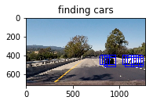

##Vehicle Detection Project

The goals / steps of this project are the following:

* Perform a Histogram of Oriented Gradients (HOG) feature extraction on a labeled training set of images and train a classifier Linear SVM classifier
* Optionally, one can also apply a color transform and append binned color features, as well as histograms of color, to the HOG feature vector.
* Note: for those first two steps don't forget to normalize the features and randomize a selection for training and testing.
* Implement a sliding-window technique and use the trained classifier to search for vehicles in images.
* Run defined pipeline on a video stream (start with the test_video.mp4 and later implement on full project_video.mp4) and create a heat map of recurring detections frame by frame to reject outliers and follow detected vehicles.
* Estimate a bounding box for vehicles detected.

## [Rubric](https://review.udacity.com/#!/rubrics/513/view) Points
###Here I will consider the rubric points individually and describe how I addressed each point in my implementation.  

---
###Histogram of Oriented Gradients (HOG)

####1. Extracting HOG features from the training images.

The code for this step is contained in the first two cells of the IPython notebook file "P5.ipynb"  

I started by reading in all the `vehicle` and `non-vehicle` images.  Here is an example of one of each of the `vehicle` and `non-vehicle` classes:

I then explored different color spaces and different `skimage.hog()` parameters (`orientations`, `pixels_per_cell`, and `cells_per_block`).  I grabbed random images from each of the two classes and displayed them to get a feel for what the `skimage.hog()` output looks like(in function `get_hog_features`). Here is the examples using the `YCrCb` color space and HOG parameters of `orientations=9`, `pixels_per_cell=(8, 8)`,`cells_per_block=(2, 2)` and `spatial_size = (32, 32)`:

vehicle

non-vehicle

####2. Settling on the final choice of HOG parameters.

I tried various combinations of parameters and applied them to the test images. By using the parameters in the lectures as starting point and comparing the prediction accuracies and prediction results on several test video frames the choice of the HOG parameter could be made.

####3. Training a SVM classifier using HOG features, color histogram features and spatial binned color features.

I trained a linear SVM using sklearn libraries. I first split the car and not car images to training (80%) and test(20%) set. And then extracted the spatial color features(`bin_spatial`), color histogram features(`color_hist`) and hog features(`get_hog_features`) of those images, so that I could train the linear SVM classifier with normalized concatenated three feature vectors. Followed by using `svc.score` to get the accuracy of prediction on the feature vectors of the test set.

###Sliding Window Search

####1. The implementation of sliding window and prediction.

I decided to restrict the search area by defining the start and stop y position as 400 and 700 respectively, since only there the cars possibly appear. And then using the Hog Sub-sampling Window Search method learned from the lectures to do window sliding on the restricted area. This approach allow us to extract the hog image only once and then sub-sampled to get all of its overlaying windows. The overlapping area of two sliding windows is defined by the number of cell distance. In my case the cell distance is 2 and for a 8x8 window size, it means a 75% overlapping. By feeding the extracted spatial binned color, color histogram features and the hog sub-sample hog features of each sub-frame to the trained classifier, a prediction of car/no car could be made. This implementation is found in the fourth code cell in "P5.ipynb".

####2. Following are prediction results of two test images

Ultimately I used YCrCb 3-channel HOG features plus spatially binned color and histograms of color in the feature vector. Here are some example images:

---

### Video Implementation

####1. The final video output

The video is called project_video_output.mp4 in the same directory of the writeup file.

####2. Filtering the false positives and combining overlapping bounding boxes.

I recorded the positions of positive detections in each frame of the video.  From the positive detections I created a heatmap and then thresholded that map to identify vehicle positions.  I then used `scipy.ndimage.measurements.label()` to identify individual blobs in the heatmap.  I then assumed each blob corresponded to a vehicle.  I constructed bounding boxes to cover the area of each blob detected.  

Here's an example result showing the heatmap from a series of test images, the result of `scipy.ndimage.measurements.label()` and the bounding boxes then overlaid on the last frame of video:

### Here are three test images and their corresponding heatmaps:

### Here is the output of `scipy.ndimage.measurements.label()` on the integrated heatmap from all three above test images:

### Here the resulting bounding boxes are drawn onto the last frame in the video:

---

###Discussion

####1. Briefly discuss any problems / issues you faced in your implementation of this project.  Where will your pipeline likely fail?  What could you do to make it more robust?

The pipeline could fail if it needs a real time detection since the processing time is pretty slow (at least with my computer). With parameters fine tuning of the hog features and the sliding window as well as threshold of the heatmap could improve the robustness of the detection. Another approach would be using the deep learning neural network instead of SVM. It would be interesting to try it out and compare it with the SVM approach.  
